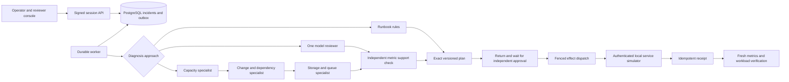

# Architecture and authorization boundaries

## Durable state

An incident stores its tenant, current revision and checkpoint, immutable evidence history, plan sequence, approval, reviewer change request, model results, bounded trace, budget and effect receipts. A worker owns a random lease token and attempt owner; every publication checks the current unexpired lease and expected revision. Abandoned lease time is charged before recovery. PostgreSQL schema bootstrap and mutations serialize through a database advisory lock. SQLite provides the same behavioral contract for focused tests.

The original LangGraph 0.0.21 `StateGraph` has collection, generalist diagnosis, three individual specialist nodes, planning, execution and verification. Each node calls one fenced domain transition and commits its result. Waiting for a human returns from graph invocation. A later invocation reloads the database cursor and resumes; no in-memory checkpoint or modern interrupt API grants authority. Completed specialists are not re-run on ordinary resume. A model process lost before completing a reserved call consumes its attempt budget if retried.

## Evidence and model authority

The simulator exposes metrics, bounded logs, workload status and a monotonic service generation, without revealing hidden fault labels. Evidence snapshots have stable reference identifiers and content digests. Model output can propose only allowlisted labels in its assigned role. Every label must independently satisfy its current metric runbook threshold; source references are assigned from that checked evidence. Logs are untrusted input, generated text is escaped in the browser and model output never supplies executable commands or tool destinations.

FLAN runs in a separate authenticated process with no database or simulator keys. Original model files are verified by hash before loading. Requests, context and generated tokens are bounded; inference is serial. The model cannot authorize an effect. Model outages, unsupported outputs and exhausted budgets escalate with a retained record instead of silently switching approaches.

## Identity and human review

Local accounts use salted PBKDF2 password hashes. Sessions are signed HS256 JWTs with issuer, audience, expiry and a revocable session ID. Tenant and current account roles are rechecked from the database on every request. The browser holds the token in memory; logout revokes the stored session. Viewer, operator, approver and administrator controls have independent API enforcement.

An approval binds the exact tenant, incident, plan digest, plan version, evidence digest and service generation. The plan author cannot approve it. Editing the plan, recollecting evidence or requesting changes invalidates approval. An unchanged plan with an outstanding reviewer change request cannot be approved. Before every effect, the worker rechecks approval expiry, the reviewer's current access, lease ownership and simulator generation.

## Effect commit boundary

Before dispatch, a durable outbox entry binds tenant, incident, exact plan digest and action index. The simulator atomically checks the requested generation, changes only the allowlisted service field and stores a receipt. Repeating the same key and request returns that receipt; changing the request under the same key fails. Receipt reads are scoped to the target service.

The worker may crash after the remote effect and before its local acknowledgement. Recovery first looks up the factual receipt, then records it in the same PostgreSQL transaction as the incident update. A receipt can be reconciled after cancellation or revoked authority because recording an already completed fact is not a new mutation. New effects still require current approval. Cancellation and role changes serialize with the bounded HTTP dispatch transaction; receipts never disappear when work is cancelled.

A receipt transport outage keeps uncertainty in the outbox, defers the candidate with bounded backoff and allows unrelated incidents to progress. After three unavailable receipt checks, the incident escalates. It can be investigated and reconciled later. Default budgets are 24 domain steps, six model calls, three prepared effects and 120 seconds of active execution; each effect has at most three dispatch attempts.

## Deliberate limits

This is a local operations lab. The six remediation handlers alter a disposable simulator, not a production cloud account or operating system. Rules directly model the known fault families. The small model's measured accuracy is limited. Local account administration is supplied instead of enterprise SSO.

The reference PostgreSQL store serializes writes and holds its lock during a bounded simulator call. This makes the authorization boundary inspectable but limits throughput. Queue scans read incident documents rather than using a production scheduling index. Model requests are serialized and have no cross-worker concurrency coordinator. A production adaptation needs measured capacity, scoped service credentials, migrations, a deployment identity system and reviewed real adapters.
